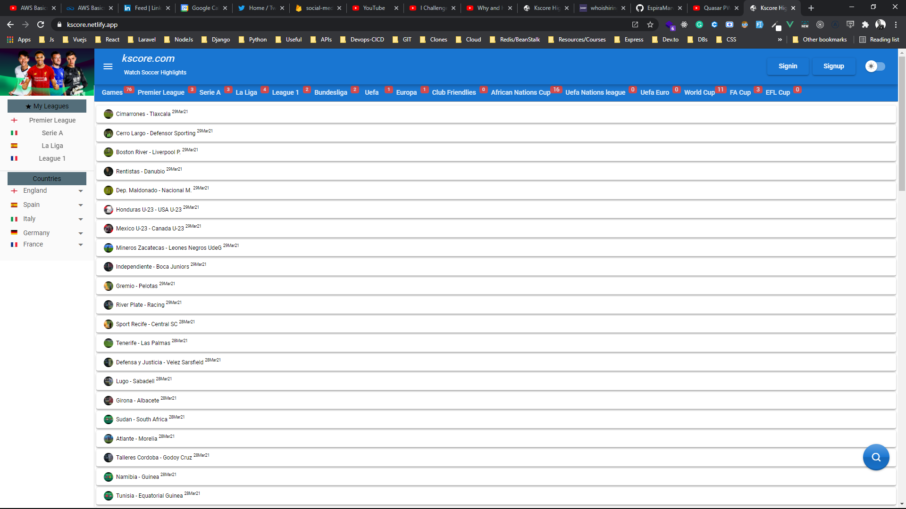
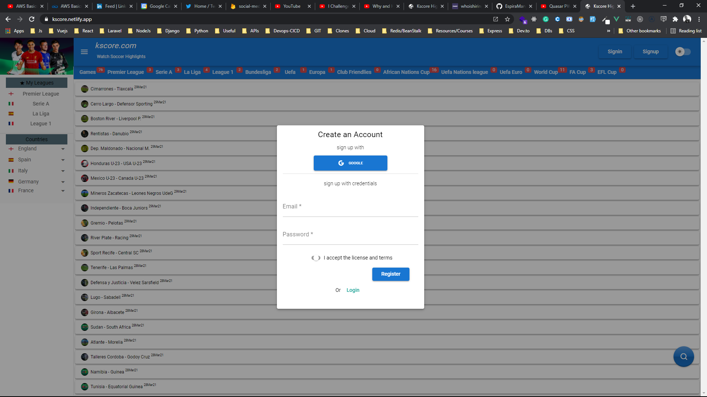
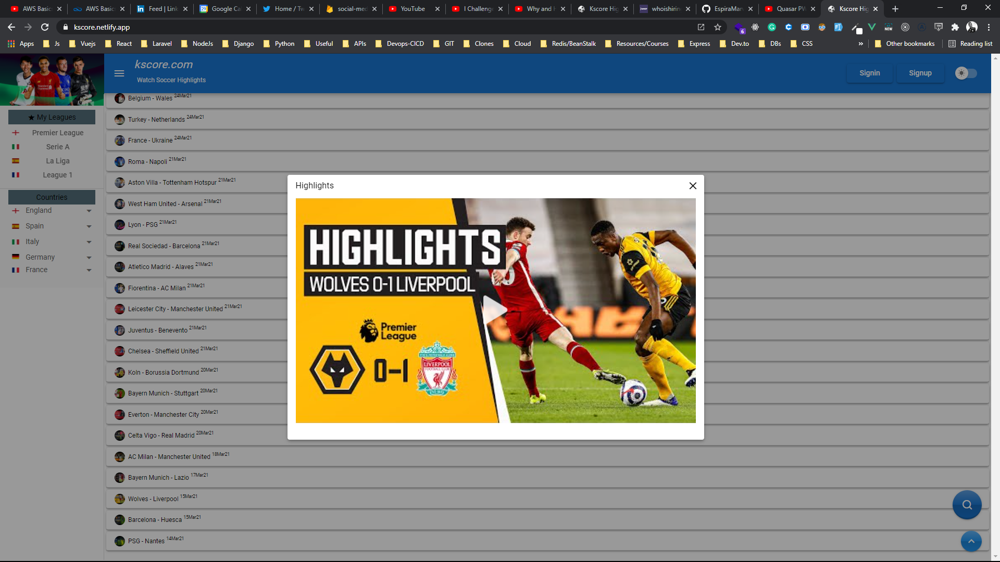
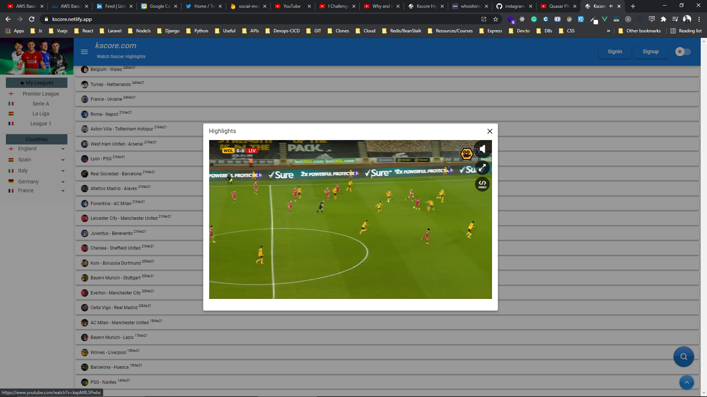
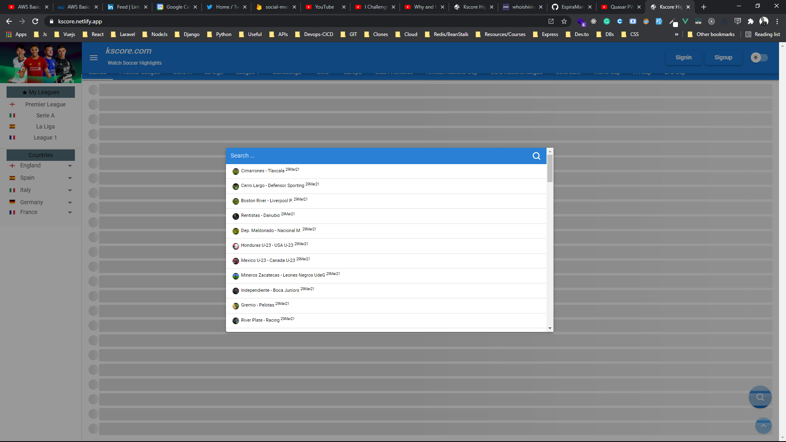

# Match Highlights (match-highlights-app)

A match highlights app

## Install the dependencies
```bash
yarn
```

### Start the app in development mode (hot-code reloading, error reporting, etc.)
```bash
quasar dev
```

### Lint the files
```bash
yarn run lint
```

### Build the app for production
```bash
yarn build
```

<div>







</div>

